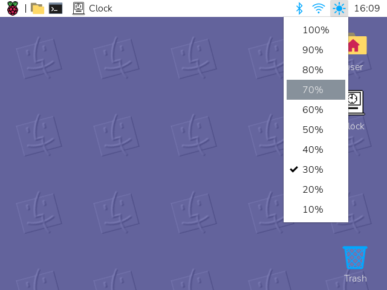

# wfplug-brightness

A [wf-panel-pi](https://github.com/raspberrypi/wf-panel-pi) plugin that adds a
brightness control to the Raspberry Pi panel for displays whose backlight is
driven by a PWM pin (tested on the Waveshare 2.8" DPI LCD with `pin=18`).



> Written by [Claude](https://www.anthropic.com/claude) (Anthropic) in Claude Code.

Clicking the sun icon opens a menu of brightness levels (100% → 10%) with a
check next to the current one. Hovering shows `Brightness: N%`. The selected
level is persisted to `~/.config/wfplug-brightness/level` and restored at boot
by a small systemd service (so the backlight comes up at the right level before
the panel has finished loading).

## Requirements

- wf-panel-pi (the Raspberry Pi OS Wayland panel)
- `gtkmm-3.0` ≥ 3.24
- meson, ninja, a C++17 compiler
- A PWM-driven backlight exposed at `/sys/class/pwm/pwmchip0/pwm0`. For the
  Waveshare 2.8" DPI LCD, add the following to `/boot/firmware/config.txt`:

  ```
  dtoverlay=pwm,pin=18,func=2
  ```

- The user running the panel must be in the `gpio` group (it usually is on Pi
  OS) so the PWM sysfs files are writable without root.

## Build & install

Clone the repo on the Pi and build locally:

```sh
sudo apt install meson libgtkmm-3.0-dev libglm-dev libgtk-layer-shell-dev
cd wfplug-brightness
meson setup builddir --prefix=/usr --libdir=lib/aarch64-linux-gnu
meson compile -C builddir
sudo meson install -C builddir
```

Enable the boot-time restore service (substitute your username):

```sh
sudo systemctl enable wfplug-brightness@$USER.service
```

Add the plugin to the panel. Edit `~/.config/wf-panel-pi/wf-panel-pi.ini` and
include `brightness` somewhere in the `widgets_right=` (or `widgets_left=`)
list — for example:

```
widgets_right=... bluetooth spacing2 netman spacing2 volumepulse spacing2 brightness spacing2 clock ...
```

Restart the panel:

```sh
pkill wf-panel-pi
```

## Uninstall

```sh
sudo systemctl disable --now wfplug-brightness@$USER.service
sudo rm /usr/lib/aarch64-linux-gnu/wf-panel-pi/libbrightness.so
sudo rm /usr/share/wf-panel-pi/metadata/brightness.xml
sudo rm /lib/systemd/system/wfplug-brightness@.service
sudo rm -r /usr/libexec/wfplug-brightness
sudo rm /usr/share/icons/hicolor/*/status/brightness-panel.png
```

## Layout

- `src/brightness.{cpp,hpp}` — the panel plugin (shared module loaded by wf-panel-pi)
- `src/brightness.xml` — plugin metadata for the panel's config UI
- `scripts/apply-brightness.sh` — boot-time restore script
- `data/wfplug-brightness@.service` — systemd template unit that invokes it
- `data/icons/hicolor/…/brightness-panel.png` — panel status icon
- `scripts/make_panel_icon.py` — regenerates the icon at all hicolor sizes

## License

MIT
